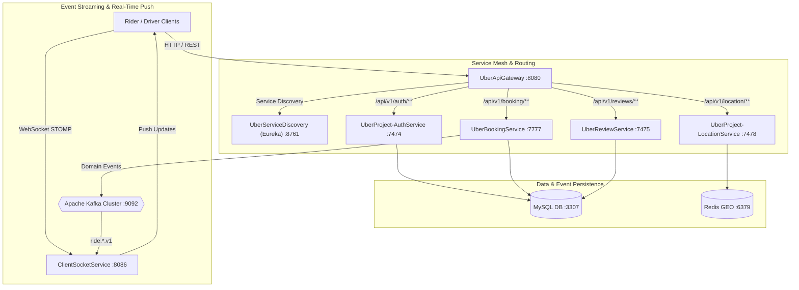

# 🚖 Uber Microservices Platform — Technical Showcase & Interviewer Guide

This guide provides a step-by-step walkthrough to present the **UberBackend** microservices platform during technical interviews. It includes architecture diagrams, API request examples, live WebSocket demonstration instructions, deep-dive explanations of core engineering patterns, and answers to high-frequency system design questions.

---

## 🏗️ 1. Architecture Overview

The system is designed following modern distributed system patterns, separating concerns across independently deployable Spring Boot 3 microservices communicating via REST, Kafka event streaming, and STOMP WebSockets.



### Microservice Inventory & Port Allocation

| Service Name | Port | Tech Stack | Role & Responsibility |
| :--- | :---: | :--- | :--- |
| **`UberApiGateway`** | `8080` | Spring Cloud Gateway, Reactive Web | Edge Router, CORS, `X-Correlation-ID` tracing filter |
| **`UberServiceDiscovery`** | `8761` | Netflix Eureka Server | Service Registry & Dynamic Instance Lookup |
| **`UberProject-AuthService`** | `7474` | Spring Security, JWT, BCrypt, MySQL | Passenger/Driver Registration & Session Issuance |
| **`UberBookingService`** | `7777` | Spring Data JPA, Kafka, `@Transactional` | Booking Lifecycle State Machine & Concurrency Control |
| **`UberProject-LocationService`** | `7478` | Redis GEO (`GEOADD`, `GEOSEARCH`) | High-frequency GPS Location Ingestion & Radius Queries |
| **`ClientSocketService`** | `8086` | WebSockets, STOMP, Kafka Listener | Real-time Bi-directional Push Notifications |
| **`UberReviewService`** | `7475` | Spring Data JPA, MySQL | Rating Aggregation & Review Management |

---

## 🎯 2. Step-by-Step Interviewer Demo Script

Follow this sequence during a live coding or architecture interview demonstration.

### Step 1: Show Service Discovery Health
- **Action**: Open browser to [`http://localhost:8761`](http://localhost:8761).
- **Interviewer Explanation**: 
  > *"All 6 microservices dynamically register with Netflix Eureka on startup. The API Gateway queries Eureka (`lb://SERVICE-NAME`) to resolve instances without hardcoding IP addresses."*

---

### Step 2: Passenger & Driver Auth (`UberProject-AuthService`)
- **Passenger Registration**:
  ```bash
  curl -X POST http://localhost:8080/api/v1/auth/signup/passenger \
    -H "Content-Type: application/json" \
    -d '{
      "name": "Alice Rider",
      "email": "alice@example.com",
      "password": "Password@123",
      "phoneNumber": "9876543210"
    }'
  ```
  - **Status**: `201 Created`
  - **Interviewer Explanation**: Passwords are encrypted using BCrypt before persistence.

- **Passenger Login & JWT Issuance**:
  ```bash
  curl -X POST http://localhost:8080/api/v1/auth/signin/passenger \
    -H "Content-Type: application/json" \
    -d '{
      "email": "alice@example.com",
      "password": "Password@123"
    }'
  ```
  - **Status**: `200 OK` (Sets `jwt` HTTP-only cookie).

---

### Step 3: High-Frequency GPS Tracking (`UberProject-LocationService`)
- **Driver GPS Location Update**:
  ```bash
  curl -X POST http://localhost:8080/api/location/drivers \
    -H "Content-Type: application/json" \
    -d '{
      "driverId": "1",
      "latitude": 28.6139,
      "longitude": 77.2090
    }'
  ```
  - **Status**: `201 Created`
  - **Interviewer Explanation**: 
    > *"GPS coordinates are written directly to Redis GEO (`GEOADD`), bypassing MySQL write amplification. The service updates Redis whenever spatial coordinates change."*

- **Spatial Proximity Radius Search**:
  ```bash
  curl -X POST http://localhost:8080/api/location/nearby/drivers \
    -H "Content-Type: application/json" \
    -d '{
      "latitude": 28.6139,
      "longitude": 77.2090
    }'
  ```
  - **Status**: `200 OK` (Returns list of nearby drivers within 5km).

---

### Step 4: Idempotent Ride Booking (`UberBookingService`)
- **Create Booking**:
  ```bash
  curl -X POST http://localhost:8080/api/v1/booking \
    -H "Content-Type: application/json" \
    -H "Idempotency-Key: idemp-req-uuid-101" \
    -d '{
      "passengerId": 1,
      "startLocation": {"latitude": 28.6139, "longitude": 77.2090},
      "endLocation": {"latitude": 28.7041, "longitude": 77.1025}
    }'
  ```
  - **Status**: `201 Created` -> Response: `{"bookingId": "37", "bookingStatus": "REQUESTED"}`
  - **Interviewer Explanation**:
    > *"If the network drops and the client retries with the same `Idempotency-Key`, `IdempotencyService` intercepts the request and returns the cached booking response without generating a duplicate database record."*

---

### Step 5: Ride Acceptance & Concurrency Control (`UberBookingService`)
- **Driver Accepts Ride**:
  ```bash
  curl -X PATCH http://localhost:8080/api/v1/booking/37 \
    -H "Content-Type: application/json" \
    -d '{
      "driverId": 1,
      "status": "DRIVER_ACCEPTED"
    }'
  ```
  - **Status**: `200 OK` -> Response: `{"bookingId": 37, "status": "DRIVER_ACCEPTED", "driver": {...}}`
  - **Interviewer Explanation**:
    > *"This method is enclosed in a `@Transactional` boundary. It executes an atomic SQL reservation `UPDATE driver SET driver_state='RESERVED', is_available=false WHERE id=1 AND is_available=true`. If another driver attempts to accept the same ride simultaneously, the second transition is rejected with a 409 Conflict."*

---

### Step 6: Post-Ride Review (`UberReviewService`)
- **Publish Review**:
  ```bash
  curl -X POST http://localhost:8080/api/v1/reviews \
    -H "Content-Type: application/json" \
    -d '{
      "content": "Excellent ride!",
      "rating": 5.0,
      "bookingId": 37
    }'
  ```
  - **Status**: `201 Created`

---

## 🔑 3. Key Engineering Patterns to Highlight

1. **Concurrency Control & Double Assignment Prevention**:
   - Uses conditional SQL updates (`UPDATE driver SET driver_state='RESERVED'... WHERE is_available=true`) combined with `@Version` Optimistic Locking on JPA entities.
2. **Transaction Synchronization**:
   - Database mutations commit before triggering external network I/O. Kafka events are deferred using `TransactionSynchronizationManager.registerSynchronization(afterCommit(...))`.
3. **High-Throughput Spatial Offloading**:
   - Redis GEO (`GEOADD`, `GEOSEARCH`) handles driver coordinates in-memory, permitting sub-2ms radius lookups.
4. **Idempotency Strategy**:
   - HTTP requests carrying `Idempotency-Key` headers store responses with TTL, preventing duplicate ride creation on network retries.
5. **State Machine Invariants**:
   - Enums `BookingStatus` and `DriverState` enforce transition rules (`canTransitionTo()`), rejecting illegal status jumps (e.g. `COMPLETED` -> `REQUESTED`).

---

## ❓ 4. Top 10 Technical Interview Questions & Answers

### Q1: How do you prevent two drivers from accepting the same ride request concurrently?
> **Answer**:
> We enforce concurrency control at both the DB and service layer. `DriverRepository` executes an atomic conditional SQL update:
> `UPDATE driver SET driver_state='RESERVED', is_available=false WHERE id=? AND is_available=true AND driver_state='AVAILABLE'`
> Only 1 query execution returns an updated row count of `1`. Competing requests receive `0` updated rows and throw an `IllegalStateException`. Additionally, JPA `@Version` optimistic locking detects concurrent modifications.

### Q2: Why did you use Redis GEO instead of MySQL spatial queries for location tracking?
> **Answer**:
> Driver GPS coordinates are updated continuously. Writing high-frequency GPS updates to MySQL causes high disk I/O, lock contention, and index fragmentation. Redis GEO stores coordinates in an in-memory Geohash sorted set, allowing us to perform radius searches (`GEOSEARCH`) in under 2ms without impacting the main relational database.

### Q3: How do you guarantee idempotency on API requests?
> **Answer**:
> The `BookingController` supports an `Idempotency-Key` header. When received, `IdempotencyService` checks Redis for an existing cached response. If present, it returns the cached DTO immediately. If not, it executes the transaction and stores the response in Redis with a 10-minute TTL.

### Q4: How does transaction management interact with Kafka event publishing?
> **Answer**:
> Publishing a Kafka event inside an active database transaction can lead to data inconsistencies if the transaction rolls back after the event is emitted. We use `TransactionSynchronizationManager.registerSynchronization(afterCommit(...))` to ensure Kafka events are sent only after the database transaction successfully commits.

### Q5: How do you handle failure when an downstream service is unavailable?
> **Answer**:
> Inter-service calls via Retrofit / RestTemplate use timeouts and fallback mechanisms. For instance, if `LocationService` is unreachable during auto-assignment, `BookingService` falls back to top available drivers in MySQL or logs a warning while leaving the booking in `REQUESTED` state for driver polling.

### Q6: How does the Gateway route requests to microservices?
> **Answer**:
> Spring Cloud Gateway registers with Eureka Service Discovery. Routes configured as `lb://UBERBOOKINGSERVICE` dynamically resolve instance IP addresses from Eureka and apply client-side round-robin load balancing.

### Q7: Why use WebSockets over STOMP for driver notifications instead of HTTP polling?
> **Answer**:
> HTTP polling creates massive overhead with thousands of drivers pinging the server every second. STOMP over WebSockets maintains a persistent TCP connection. `ClientSocketService` listens to Kafka topics and pushes real-time ride offers directly to specific driver WebSocket channels.

### Q8: How do you secure microservice endpoints?
> **Answer**:
> `UberApiGateway` executes a global `JwtAuthFilter` that validates incoming JWT tokens or cookies, extracts user identity, and injects `X-User-Email` headers into downstream requests. `ClientSocketService` uses `JwtChannelInterceptor` to authenticate STOMP handshakes and assign a `Principal` to the WebSocket session.

### Q9: How do you manage database schema changes across microservices?
> **Answer**:
> We use Flyway versioned migration scripts (`V1__init_db.sql` through `V8__add_driver_auth_fields.sql`) stored in the shared `Uber-entityService`. When microservices boot up, Flyway validates and applies pending schema migrations transactionally.

### Q10: How would you scale this architecture for millions of concurrent rides?
> **Answer**:
> To scale further, we would:
> 1. Partition Kafka topics by `rideId` or `geohash` zone for parallel consumption.
> 2. Cluster Redis using Redis Sentinel or Redis Cluster for spatial data sharding.
> 3. Implement the Transactional Outbox Pattern to decouple database writes from Kafka publishing completely.
