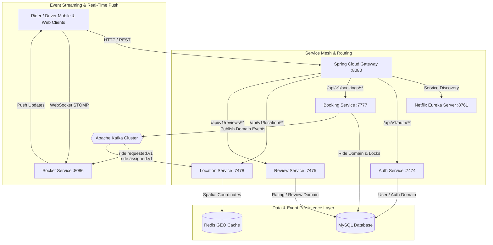

# 🚖 Uber Distributed Microservices Platform

A production-ready, high-throughput distributed system built with **Spring Boot 3**, **Spring Cloud Gateway**, **Netflix Eureka**, **Apache Kafka**, **Redis GEO**, and **Docker**.

Designed and implemented following modern enterprise microservices patterns for high availability, fault tolerance, concurrency safety, and real-time event streaming.

---

## 📐 System Architecture



---

## 🛠️ Tech Stack & Service Breakdown

| Service | Port | Key Technologies | Responsibility |
| :--- | :--- | :--- | :--- |
| **`UberApiGateway`** | `8080` | Spring Cloud Gateway, Reactive Streams | Edge router, CORS handling, `X-Correlation-ID` header filter |
| **`UberServiceDiscovery`** | `8761` | Netflix Eureka Server | Dynamic service registration & client load balancing |
| **`UberProject-AuthService`**| `7474` | Spring Security, JWT, Spring Data JPA | User authentication, token issuance, passenger/driver registration |
| **`UberBookingService`** | `7777` | Spring Boot, Spring Kafka, Optimistic Locking | Ride lifecycle state machine, atomic driver assignment, idempotency |
| **`UberProject-LocationService`** | `7478` | Redis GEO, Jedis, Spring Data Redis | High-frequency GPS updates, spatial radius search (`GEOSEARCH`) |
| **`UberReviewService`** | `7475` | Spring Data JPA, MySQL | Post-trip ratings, driver/passenger reviews |
| **`ClientSocketService`** | `8086` | Spring WebSocket, STOMP, Kafka Listener | Real-time driver location and ride status streaming to clients |

---

## 🔑 Key Engineering Patterns

### 1. Concurrency Control & Double Assignment Prevention
- **Atomic Driver Reservation**: Utilizes conditional SQL updates `UPDATE driver SET driver_state='RESERVED', is_available=false WHERE id=? AND is_available=true AND driver_state='AVAILABLE'` to guarantee that parallel booking attempts for the same driver yield **exactly 1 success** and **controlled failure responses** for all competing requests.
- **Optimistic Locking (`@Version`)**: Entity versioning prevents lost updates during concurrent ride state modifications.

### 2. Idempotency Support (`Idempotency-Key`)
- API endpoints support an `Idempotency-Key` header. Duplicate booking submissions return the cached original response without creating duplicate ride entities.

### 3. State Machines & Invariants
- **Ride State Lifecycle**: `REQUESTED` ➔ `DRIVER_ASSIGNED` ➔ `DRIVER_ACCEPTED` ➔ `DRIVER_ARRIVING` ➔ `RIDE_STARTED` ➔ `COMPLETED` (or `CANCELLED`). Illegal transitions (e.g. `COMPLETED` ➔ `REQUESTED`) are strictly validated and rejected.
- **Driver State Lifecycle**: `OFFLINE` ➔ `AVAILABLE` ➔ `RESERVED` ➔ `ON_TRIP` ➔ `AVAILABLE`.

### 4. Event-Driven Messaging with Kafka
- Standardized `DomainEvent<T>` envelope containing `eventId`, `eventType`, `rideId`, `timestamp`, `correlationId`, and `producer`.
- Topics: `ride.requested.v1`, `ride.driver.assigned.v1`, `ride.started.v1`, `ride.completed.v1`, `ride.cancelled.v1`.

### 5. High-Throughput Redis GEO Location Tracking
- Real-time GPS coordinates bypass MySQL to avoid database write amplification.
- Fast spatial radius search (`within 5 km radius`) using Redis `GEOADD` and `GEOSEARCH` (`Point(longitude, latitude)`).

---

## 🚀 Quickstart with Docker Compose

### Prerequisites
- Docker Engine 24.0+
- Docker Compose 2.20+

### Start the Complete System
```bash
# Clone the repository
git clone https://github.com/your-username/UberBackend.git
cd UberBackend

# Create local environment configuration
cp .env.example .env

# Launch all microservices, databases, Redis, Kafka, and Eureka
docker compose up -d --build
```

### Verify Running Stack
- **API Gateway**: `http://localhost:8080`
- **Eureka Service Dashboard**: `http://localhost:8761`
- **MySQL DB**: `localhost:3306`
- **Redis Cache**: `localhost:6379`
- **Kafka Cluster**: `localhost:9092`

---

## 🧪 Testing & Concurrency Verification

### Run Concurrency Test Suite
Executes 100 simultaneous threads competing for 1 driver:
```bash
cd UberBookingService
./gradlew test --tests com.example.uberbookingservice.BookingConcurrencyTest
```

---

## 📚 Architecture Decision Records (ADRs)

- [ADR 0001: Microservices Architecture & Eureka Service Discovery](docs/adr/0001-microservices-and-service-discovery.md)
- [ADR 0002: API Gateway & Request Correlation Tracing](docs/adr/0002-api-gateway-and-correlation-ids.md)
- [ADR 0003: Redis GEO for High-Frequency Location Tracking](docs/adr/0003-redis-geo-for-location-service.md)
- [ADR 0004: Event-Driven Architecture with Kafka](docs/adr/0004-kafka-event-driven-architecture.md)
- [ADR 0005: Concurrency Control & Idempotency Strategy](docs/adr/0005-concurrency-and-idempotency-control.md)
