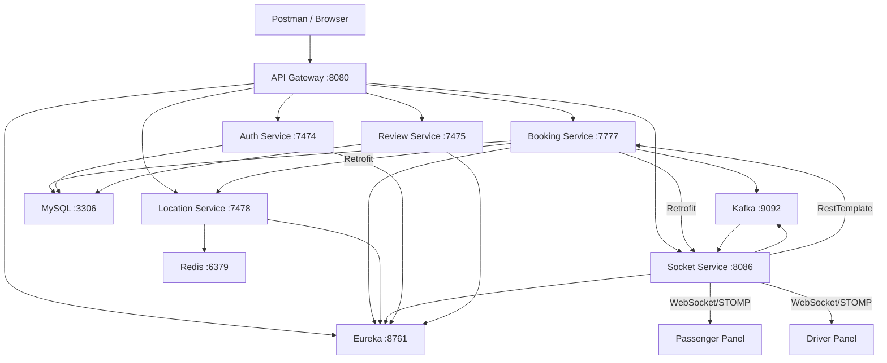

# 🚖 Uber Backend — Full Project Review

## Architecture Overview

| Service | Port | Tech Stack | Role |
|---|---|---|---|
| **API Gateway** | 8080 | Spring Cloud Gateway, Eureka | Central routing, CORS, Correlation IDs |
| **Booking Service** | 7777 | Spring Boot, JPA, Kafka, Retrofit | Ride lifecycle state machine |
| **Location Service** | 7478 | Spring Boot, Redis GEO | Driver geolocation & proximity search |
| **Socket Service** | 8086 | Spring Boot, STOMP/SockJS, Kafka | Real-time WebSocket notifications |
| **Auth Service** | 7474 | Spring Boot, Spring Security, JWT | Passenger & Driver authentication |
| **Review Service** | 7475 | Spring Boot, JPA | Driver & Passenger ratings |
| **Eureka Server** | 8761 | Spring Cloud Netflix | Service discovery |
| **Entity Library** | — | JPA, Flyway | Shared domain models & migrations |

---

## Design Patterns Used ✅

| Pattern | Where |
|---|---|
| **Microservices** | 7 independently deployable services |
| **API Gateway** | Spring Cloud Gateway with Eureka LB |
| **Service Discovery** | Netflix Eureka client/server |
| **Event-Driven (Kafka)** | Domain events (`ride.requested.v1`, `ride.driver_assigned.v1`, etc.) |
| **Finite State Machine** | `BookingStatus` & `DriverState` enums with `canTransitionTo()` |
| **Optimistic Locking** | `@Version` on Driver + atomic `reserveDriverIfAvailable` SQL |
| **Idempotency** | `Idempotency-Key` header support in booking creation |
| **Fallback/Graceful Degradation** | Retrofit → RestTemplate fallback for inter-service calls |
| **Async Non-Blocking I/O** | Retrofit `enqueue()` + Kafka `CompletableFuture.runAsync()` |

---

## What's Working Well ✅

1. **Clean layered architecture** — Controller → Service → Repository separation across all services
2. **State machine enforcement** — `BookingStatus.canTransitionTo()` prevents illegal state transitions
3. **Atomic driver reservation** — `reserveDriverIfAvailable` prevents double-booking via conditional SQL
4. **Real-time notifications** — Full Kafka → WebSocket pipeline for driver and passenger panels
5. **Health-check-driven Docker startup** — Services wait for MySQL/Redis/Eureka to be healthy
6. **Flyway migrations** — 8 versioned DB migration scripts for schema management
7. **Domain event publishing** — Standardized `DomainEvent<T>` wrapper with ride-based partition keys
8. **Correlation ID tracking** — Gateway injects `X-Correlation-ID` across all requests

---

## Critical Issues 🔴

### 1. No Authentication on Protected Endpoints
- **Where**: `BookingController`, `ReviewController`, `LocationController` — all have **zero security**
- **Impact**: Anyone can create bookings, modify ride status, or delete reviews without identity verification
- **Fix**: Add JWT validation filter on API Gateway or Spring Security resource server on each service

### 2. Hardcoded Database Password in Config Files
- **Where**: `application.properties` in BookingService, AuthService, ReviewService, EntityService
- **Impact**: Password `Nasir@02` is committed to source code
- **Fix**: Use environment variables only, remove hardcoded defaults from properties files

### 3. Silent Failure When BookingService Update Fails
- **Where**: [`DriverRequestController.java:L93-113`](file:///d:/UberBackend/ClientSocketService/src/main/java/com/example/clientsocketservice/controller/DriverRequestController.java#L93-L113)
- **Impact**: If all 3 fallback URLs fail, the passenger is still notified that the driver accepted — but the DB was never updated. **UI and DB are out of sync.**
- **Fix**: Return boolean from `updateBookingServiceDetails()`, only notify passenger on success

### 4. In-Memory Idempotency Cache (Not Distributed)
- **Where**: [`IdempotencyService.java`](file:///d:/UberBackend/UberBookingService/src/main/java/com/example/uberbookingservice/services/IdempotencyService.java)
- **Impact**: In multi-instance deployment, retries routed to another instance bypass the cache. No TTL = memory leak risk
- **Fix**: Use Redis-backed idempotency (`SET key value NX EX 300`)

---

## Major Issues 🟠

### 5. N+1 Redis Roundtrips in Nearby Driver Query
- **Where**: [`RedisLocationServiceImpl.java:L59-70`](file:///d:/UberBackend/UberProject-LocationService/src/main/java/com/example/uberprojectlocationservice/services/RedisLocationServiceImpl.java#L59-L70)
- **Impact**: For each nearby driver, an additional `GEOPOS` call is made. 100 drivers = 101 Redis calls
- **Fix**: Use `GeoRadiusCommandArgs.includeCoordinates().sortAscending().limit(50)`

### 6. `driverRepository.findAll()` Fallback Scans Entire Table
- **Where**: [`BookingServiceImpl.java:L276`](file:///d:/UberBackend/UberBookingService/src/main/java/com/example/uberbookingservice/services/BookingServiceImpl.java#L276)
- **Impact**: Loads every driver into memory when location service fails
- **Fix**: Use `findFirstByIsAvailableTrueAndDriverState(AVAILABLE)`

### 7. Broadcast Topics Leak Data to All Users
- **Where**: `/topic/passengerNotification` and `/topic/rideRequest`
- **Impact**: Every connected passenger sees ALL booking updates, not just their own
- **Fix**: Use `/topic/passengerNotification/{passengerId}` or `convertAndSendToUser()`

### 8. `synchronized` Method Bottleneck
- **Where**: [`DriverRequestController.java:L51`](file:///d:/UberBackend/ClientSocketService/src/main/java/com/example/clientsocketservice/controller/DriverRequestController.java#L51)
- **Impact**: All driver responses are serialized through a single lock — bottleneck under load
- **Fix**: Remove `synchronized`, rely on DB-level optimistic locking

### 9. Auto-Creation of Dummy Drivers in Production Code
- **Where**: [`BookingServiceImpl.java:L144-150`](file:///d:/UberBackend/UberBookingService/src/main/java/com/example/uberbookingservice/services/BookingServiceImpl.java#L144-L150)
- **Impact**: Creates fake `Driver #<id>` records in production database
- **Fix**: Remove auto-creation, throw `DriverNotFoundException` instead

### 10. Hibernate `enable_lazy_load_no_trans=true`
- **Where**: `Uber-entityService/application.properties:L16`
- **Impact**: Known anti-pattern — hides N+1 queries, can cause connection leaks
- **Fix**: Use `JOIN FETCH` queries or DTO projections

---

## Minor Issues 🟡

| # | Issue | Where | Fix |
|---|---|---|---|
| 11 | Duplicate config files (`application.properties` + `application.yml`) with conflicting `ddl-auto` | All services | Keep one format only |
| 12 | Uppercase package names (`Consumers/`, `Producers/`) | ClientSocketService, BookingService | Rename to lowercase |
| 13 | `RetrofitConfig.java` in `controllers` package | BookingService | Move to `configuration` |
| 14 | Manual `new RestTemplate()` instead of Spring-managed bean | BookingService, SocketService | Use `@Bean @LoadBalanced RestTemplate` |
| 15 | Missing `@ControllerAdvice` global exception handler | All services | Add unified error response handler |
| 16 | `@EntityScan` on services with no JPA entities | LocationService, SocketService | Remove dead annotation |
| 17 | Unused `ObjectMapper` injected in `KafkaConsumerService` | SocketService | Remove unused dependency |
| 18 | Missing input validation (`@Valid`, `@NotNull`, `@Min`, `@Max`) | All DTOs | Add `spring-boot-starter-validation` |
| 19 | No driver offline/TTL mechanism in Redis | LocationService | Add heartbeat TTL or `ZREM` on disconnect |
| 20 | `POST` used for update instead of `PUT`/`PATCH` | BookingController | Use proper HTTP verbs |
| 21 | CORS configured in both YAML and Java bean in Gateway | UberApiGateway | Remove duplicate `CorsConfig.java` |
| 22 | Kafka `autoStartup=false` hardcoded in factory config | SocketService, BookingService | Let property control lifecycle |
| 23 | HTTP 201 returned even when `saveDriverLocation` fails | LocationController | Check boolean before returning status |

---

## API Endpoints Summary

### Booking Service (`/api/v1/booking`)
| Method | Path | Description |
|---|---|---|
| POST | `/api/v1/booking` | Create new booking |
| POST | `/api/v1/booking/{id}` | Update booking status |

### Location Service (`/api/location`)
| Method | Path | Description |
|---|---|---|
| POST | `/api/location/drivers` | Save driver location |
| POST | `/api/location/nearby/drivers` | Find nearby drivers |
| GET | `/api/location/driver/{id}` | Get driver location |

### Auth Service (`/api/v1/auth`)
| Method | Path | Description |
|---|---|---|
| POST | `/api/v1/auth/signup/passenger` | Register passenger |
| POST | `/api/v1/auth/signup/driver` | Register driver |
| POST | `/api/v1/auth/signin/passenger` | Login passenger (JWT cookie) |
| POST | `/api/v1/auth/signin/driver` | Login driver (JWT cookie) |

### Review Service (`/api/v1/reviews`)
| Method | Path | Description |
|---|---|---|
| POST | `/api/v1/reviews` | Create review |
| GET | `/api/v1/reviews` | List all reviews |
| GET | `/api/v1/reviews/{id}` | Get review by ID |
| PUT | `/api/v1/reviews/{id}` | Update review |
| DELETE | `/api/v1/reviews/{id}` | Delete review |

### Socket Service (`/api/socket`)
| Method | Path | Description |
|---|---|---|
| POST | `/api/socket/newride` | Broadcast ride request |
| GET | `/api/socket` | Health check |
| STOMP | `/app/rideResponse/{driverId}` | Driver accept/decline |

---

## Overall Verdict

| Area | Score | Notes |
|---|:---:|---|
| **Architecture** | ⭐⭐⭐⭐ | Clean microservices with proper separation |
| **State Management** | ⭐⭐⭐⭐ | FSM with transition validation |
| **Real-time Comms** | ⭐⭐⭐⭐ | Kafka + WebSocket pipeline working |
| **Data Layer** | ⭐⭐⭐ | Flyway migrations good, but anti-patterns present |
| **Security** | ⭐ | JWT exists but not enforced on protected endpoints |
| **Error Handling** | ⭐⭐ | No global handler, silent failures |
| **Code Quality** | ⭐⭐⭐ | Functional but naming/packaging issues |
| **Scalability** | ⭐⭐ | Broadcast topics, synchronized locks, findAll() scans |
| **DevOps** | ⭐⭐⭐ | Docker Compose with health checks, but single-stage builds |

> **Overall: Solid foundational architecture with good design patterns. Primary gaps are in security enforcement, error handling resilience, and scalability optimizations.**
